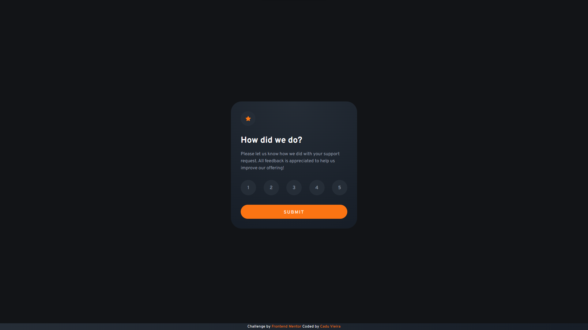
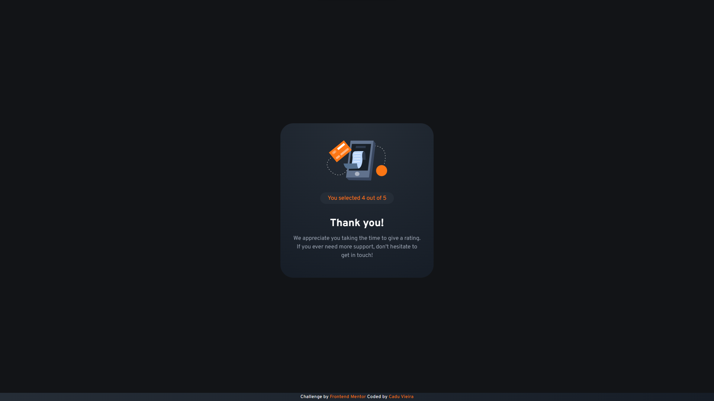
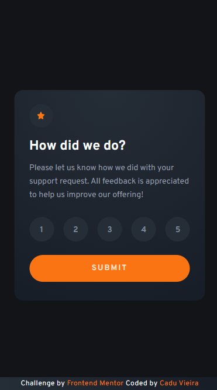

# Frontend Mentor - Interactive rating component solution

This is a solution to the [Interactive rating component challenge on Frontend Mentor](https://www.frontendmentor.io/challenges/interactive-rating-component-koxpeBUmI). Frontend Mentor challenges help you improve your coding skills by building realistic projects. 

## Table of contents

- [Overview](#overview)
  - [The challenge](#the-challenge)
  - [Screenshot](#screenshot)
  - [Links](#links)
- [My process](#my-process)
  - [Built with](#built-with)
  - [What I learned](#what-i-learned)
- [Author](#author)
- [Acknowledgments](#acknowledgments)

## Overview

### The challenge

Users should be able to:

- View the optimal layout for the app depending on their device's screen size
- See hover states for all interactive elements on the page
- Select and submit a number rating
- See the "Thank you" card state after submitting a rating

### Screenshot





### Links

- [Solution URL](https://www.frontendmentor.io/solutions/interactive-rating-component-sass-and-jquery-7hDquaxFIy)
- [Live Site URL](https://frontend-mentor-interactive-rating-component-lac.vercel.app/)

## My process

### Built with

- HTML5 
- CSS 
- Mobile-first workflow
- [Sass/Scss](https://sass-lang.com/) - For styles
- [jQuery](https://jquery.com/)

### What I learned

My first contact with Sass and jQuery.

Some code I found useful:

```javascript

const ratingMessage = [
  "We're sorry...", 
  "Well... ok.", 
  "Thanks!", 
  "Thank you!", 
  "WOW, THANK YOU!"
];


if(rating == 0) {

  alert("Please, select your rating!");
}else {
  //Write the stored rating within the h1 
  $('#thank-you h1').text(ratingMessage[rating - 1]);
}

```

## Author

- [GitHub](https://github.com/caduovieira)
- [@caduovieira](https://www.frontendmentor.io/profile/caduovieira) - Frontend Mentor Profile
- [LinkedIn](https://www.linkedin.com/in/carlos-eduardo-vieira-37b991154/)

## Acknowledgments

I'd like to thank my friend [Bernard](https://github.com/bernard-rodrigues/) for helping me out with this project!